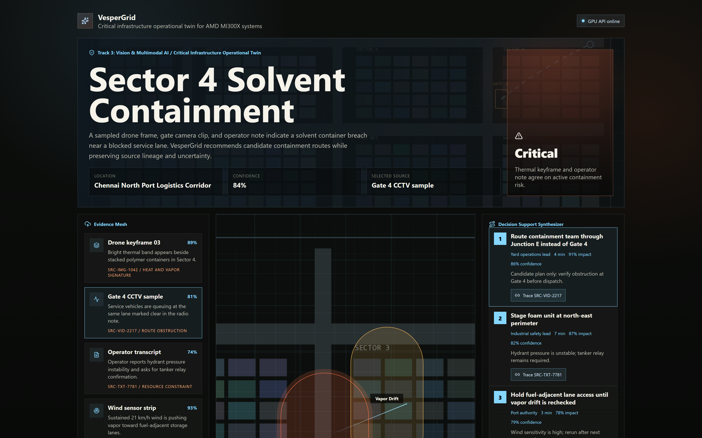
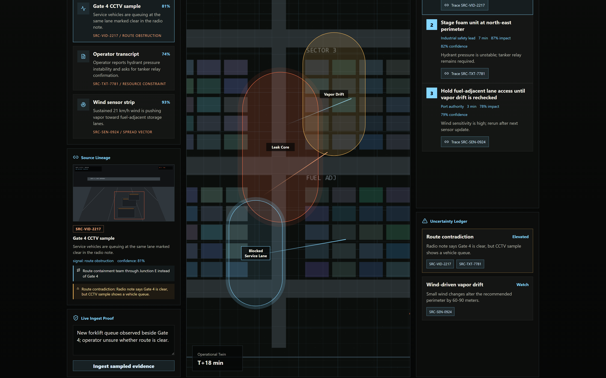

---
marp: true
theme: gaia
paginate: true
backgroundColor: '#0a0d0b'
color: '#e7eef0'
style: |
  section { font-family: ui-sans-serif, -apple-system, Segoe UI, Roboto, sans-serif; line-height: 1.4; padding: 48px 70px 60px; font-size: 26px; }
  h1 { color: #ffffff; letter-spacing: -0.01em; }
  h2 { color: #86d7ff; }
  h3 { color: #ffb181; }
  strong { color: #ffd6a8; }
  code { color: #86d7ff; background: #16201f; padding: 1px 6px; border-radius: 3px; }
  blockquote { border-left: 3px solid #ff7048; color: #ffe1a4; padding-left: 16px; }
  section.lead { background: radial-gradient(circle at 70% 30%, #1a2024 0%, #0a0d0b 60%); }
  section.lead h1 { font-size: 1.9em; }
  section.lead h2 { color: #ffb181; font-weight: 500; font-size: 1.0em; }
  ul { list-style: none; padding-left: 0; }
  ul li::before { content: '\2192  '; color: #ff7048; font-weight: 700; }
  table { border-collapse: collapse; }
  table th, table td { padding: 6px 14px; border-bottom: 1px solid #243030; }
  footer { color: #6b7a78; font-size: 0.6em; }
footer: 'VesperGrid · AMD Developer Hackathon · Track 3: Vision & Multimodal AI'
---

<!-- _class: lead -->

# VesperGrid

## Critical Infrastructure Operational Twin on AMD MI300X

A source-linked decision-support model for industrial safety incidents.
Multimodal evidence in. Candidate plans, with audit trail, out.

`Track 3 · Qwen Challenge · HF Special Prize · Build-in-Public`

---

# The 18-minute problem

A port operator gets four signals at once:

- one **drone keyframe**
- one **gate-camera clip**
- one **wind-sensor strip**
- one **operator radio note**

They contradict each other. There is no single source of truth.
Decision pressure is rising. A wrong route can cost lives.

---

# What VesperGrid does

> Turn **fragmented multimodal evidence** into a **source-linked operational twin**, with uncertainty named, not buried.

```
evidence pack → async ingest → Qwen-VL on MI300X
            → normalized graph → candidate plan + uncertainty ledger
            → every claim links back to a SRC-* UUID
```

The console is the operator's read-only view of the evidence-to-decision chain.

---

# Operations console



- **Hero band** — incident, severity, confidence
- **Evidence Mesh** — four sources, each `SRC-*` tagged
- **Decision Synthesizer** — plans linked to evidence
- Live ingest appends a fifth source: the operator note

---

# Source lineage — the wow moment



Click `SRC-VID-2217`. One UUID surfaces three things:

- the **raw CCTV thumbnail** (what the AI saw)
- the **candidate plan** it produced
- the **uncertainty issue** it created

No prose. No prompt magic. A verifiable chain.

---

# Async pipeline — no synchronous trap

```
POST /api/ingest          → { job_id }
GET  /api/ingest/{id}/events  (SSE)

queued → sampling → parsing → normalizing → synthesizing → complete
```

Per-stage SSE events drive a real progress bar in the console.

If the GPU backend fails mid-pipeline, the API soft-degrades to a deterministic
synthesizer. The demo never breaks. Schemas are Pydantic-validated end-to-end.

---

# Why AMD MI300X

| Resource | Value |
|----------|-------|
| GPU | 1× AMD Instinct MI300X |
| GPU memory | **192 GB VRAM** |
| Model | Qwen2.5-VL-7B-Instruct via vLLM ROCm |
| Tensor parallel | TP=1 (single GPU, zero NCCL/RCCL surface) |
| Multi-image budget | 5 keyframes per prompt, resident |

192 GB on one card means a frontier multimodal model stays warm with full
multi-image context between operator turns. **Latency, not FLOPs, is the bottleneck
for an operational twin.**

---

# Honesty

What is **GPU-resident** on the MI300X:

- Qwen-VL multimodal inference (paged attention, KV cache, multi-image decode)

What is intentionally **CPU-vectorized** for the MVP:

- bounded route/hazard scoring
- in-memory entity graph

The Uncertainty Ledger is **first-class**, not an afterthought. Every contradiction
is named, with a severity label and a link back to the offending source.

---

# Business value

Buyers feel the pain in cost-per-minute of downtime:

- **Ports & logistics yards** — vessel queuing, gate dwell, dangerous-goods routing
- **Energy & petrochemical** — perimeter incidents, vapor drift, evacuation paths
- **Heavy industry** — forklift collisions, contained-spill protocols

## Roadmap (post-hackathon)

- real evidence-graph backing store (Neo4j / DuckDB-vector)
- per-tenant policy packs + role-based access
- frontier-model fine-tunes on synthetic operator transcripts

---

# Submission map

| Asset | Location |
|-------|----------|
| Code repository | `<github-url>` |
| Live app (HF Space) | `<huggingface.co/spaces/...>` |
| AMD Cloud deploy | `scripts/bootstrap_amd_cloud.sh` (idempotent, single MI300X) |
| Demo evidence pack | `demo/sector4/` (synthetic, license-clean) |
| Live tracker | `PROGRESS.md` |

> **Stackable prizes claimed:** Qwen Challenge · Hugging Face Special Prize
> · Ship It / Build-in-Public

Thank you. Operators deserve evidence-grounded tools, not chatbots.
